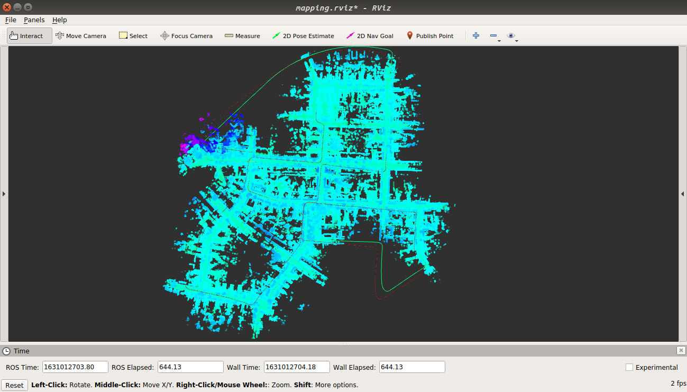
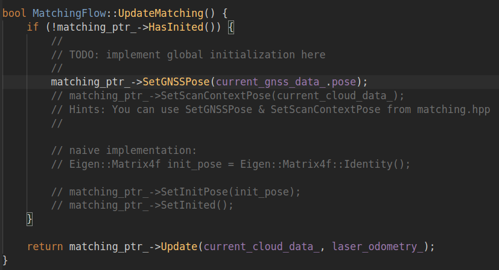
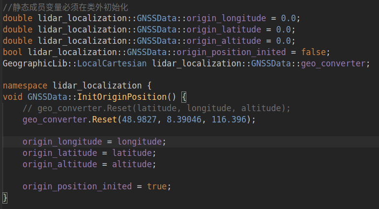
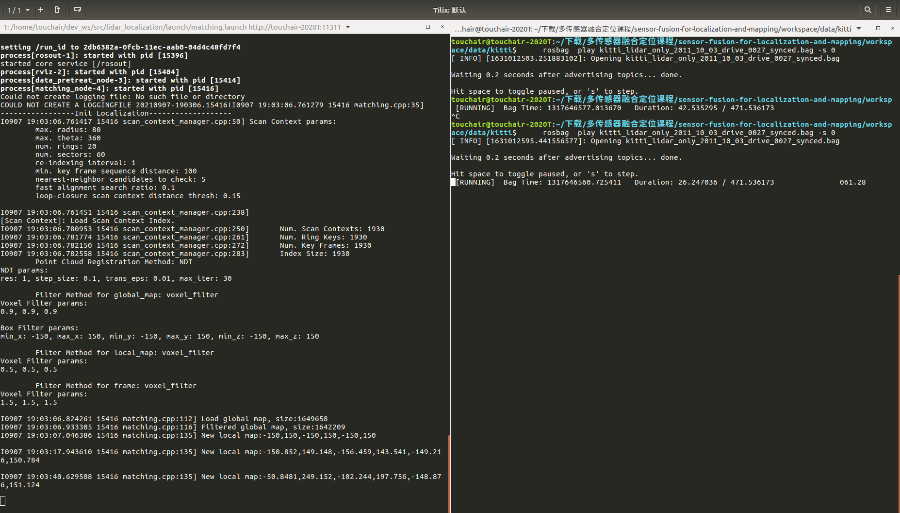
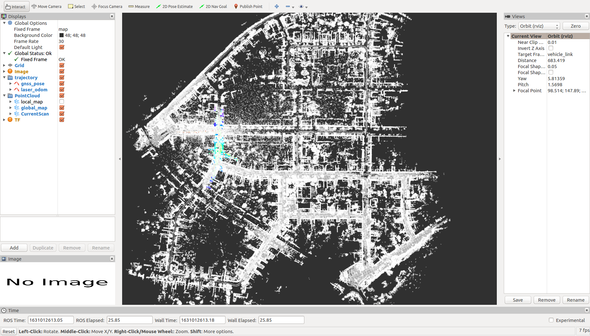
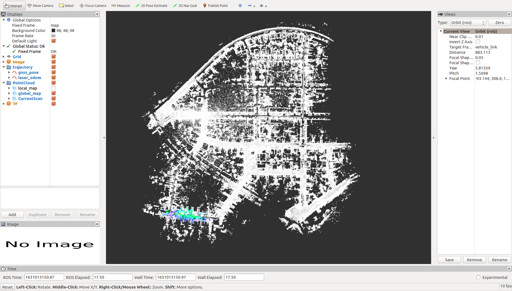
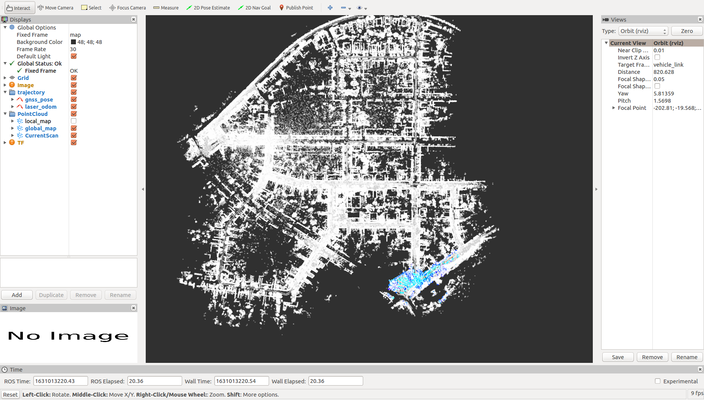
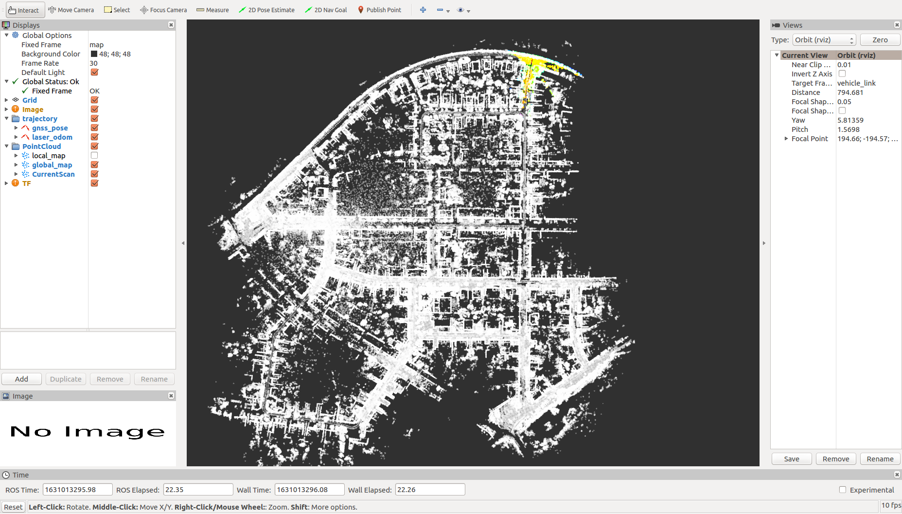

# 第四章作业

## 及格要求: 跑通建图流程、保存地图，并截图显示完整地图

建图效果如下

## 良好要求: 在建图的基础上，加载点云地图，实现在地图原点的初始化 

一、代码调用分析：
调用SetGNSSPose函数设置gnss pose为初始位姿

这样设置定位效果很差，后来查阅资料得知，GNSS是经纬度，而current_gnss_data_.pose是第一个GNSS为原点转换过的xyz坐标。在任意点经过转换后的xyz坐标接近(0,0,0)，因此要把0s时刻的第一帧GNSS经纬度永远作为原点，而不是把(0,0,0)作为原点,代码中的三个数值是0s的GNSS经纬度数值。

## 优秀要求: 在建图的基础上，实现全局初始化的要求

1. 0s处初始化如下

   
   

2. 100s初始化

   

3. 200s初始化

   

4. 300s初始化

   

5. 400s初始化

   

