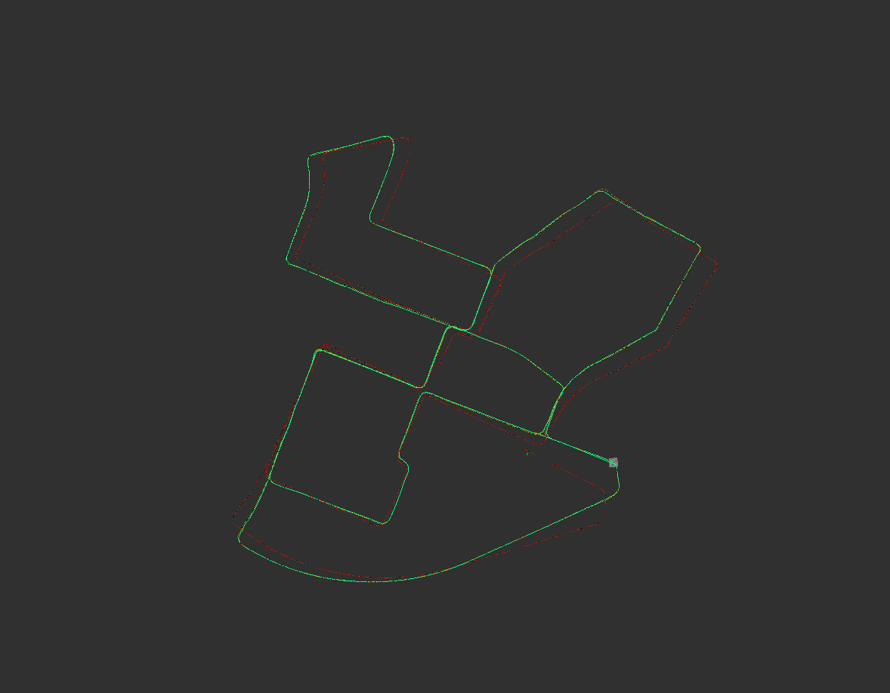
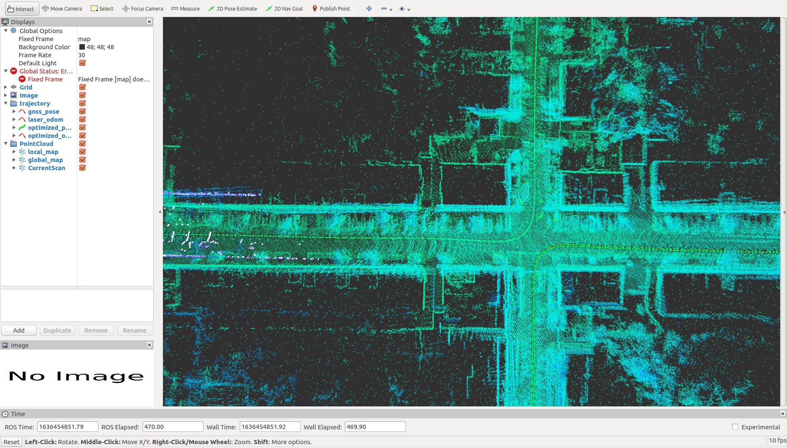
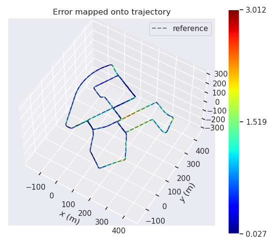
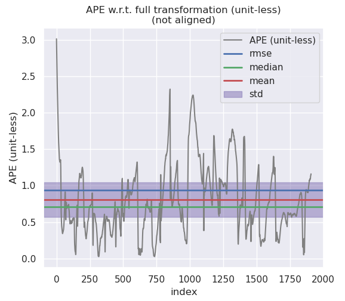
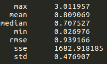
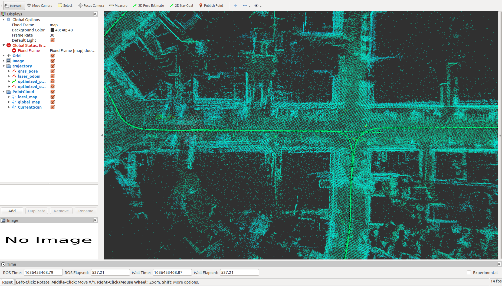
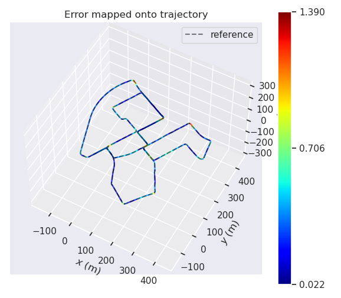
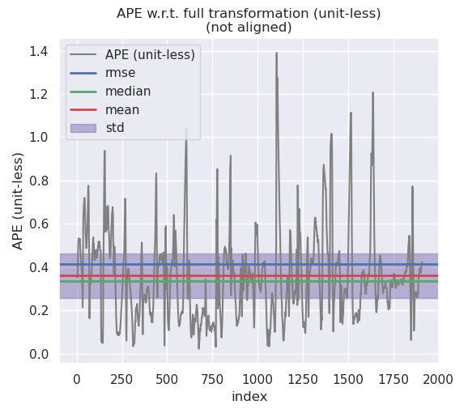
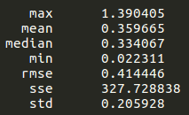

# 第九章作业

## 补全预积分的相关公式

预积分的残差如下:
$$
\begin{bmatrix} r_p \\ r_q \\ r_v \\ r_{ba} \\ r_{bg} \end{bmatrix} = \begin{bmatrix}
q_{wb_i}^{*}(p_{wb_j} - p_{wb_i} - v_i^w \Delta t + \frac{1}{2}g^w \Delta t^2) - \alpha_{b_i b_j} \\
2[q_{b_i b_j}^{*} \bigotimes (q_{wb_i}^{*} \bigotimes q_{w b_j})]_{xyz} \\
q_{w b_i}^{*}(v_j^w - v_i^w + g^w \Delta t) - \beta_{b_i b_j} \\
b_j^a - b_i^a \\
b_j^g - b_i^g
\end{bmatrix}
$$
接下来写出预积分残差对于各个变量的雅各比

### 姿态残差的雅各比

1. 对i时刻姿态的雅各比
   $$
   \frac{\partial r_q }{\partial \delta \theta_{b_i b_i^{'}}} = -2 \begin{bmatrix} 0 & I \end{bmatrix} [q_{w b_j}^{*} \bigotimes q_{w b_I}]_{L}[q_{b_i b_j}]_{R} \begin{bmatrix} 0 \\ \frac{1}{2}I \end{bmatrix}
   $$
   
2. 对j时刻姿态的雅各比
   $$
   \frac{\partial r_q }{\partial \delta \theta_{b_j b_j^{'}}} = -2 \begin{bmatrix} 0 & I \end{bmatrix} [q_{w b_j}^{*} \bigotimes q_{w b_I}]_{L}[q_{b_i b_j}]_{R} \begin{bmatrix} 0 \\ \frac{1}{2}I \end{bmatrix}
   $$

3. 对i时刻陀螺仪bais偏差的雅各比
   $$
   \frac{\partial r_q}{\partial \delta b_i^g} = -2 \begin{bmatrix} 0 & I \end{bmatrix}[q_{w b_j}^{*} \bigotimes q_{w b_i} \bigotimes q_{b_i b_j}]_L \begin{bmatrix} 0 \\ \frac{1}{2} J_{b_i^g}^q \end{bmatrix}
   $$

### 速度残差的雅各比

1. 对i时刻姿态的雅各比
   $$
   \frac{\partial r_v}{\partial \delta \theta_{b_i b_i^{'}}} = [R_{b_iw}(v_j^w - v_i^w + g^w \Delta t)]_{\times}
   $$
   
2. 对i时刻速度的雅各比
   $$
   \frac{\partial r_v}{\partial \delta v_i^w} = -R_{wb_i}
   $$
   
3. 对j时刻速度的雅各比
   $$
   \frac{\partial r_v}{\partial \delta v_j^w} = R_{wb_i}
   $$
   
4. 对i时刻加速度计bias的雅各比
   $$
   \frac{\partial r_v}{\partial \delta b_i^a} = -\frac{\partial \beta_{b_i b _j}}{\partial \delta b_i^a} = - J_{b_i^a}^{\beta}
   $$

5. 对i时刻陀螺仪bias的雅各比
   $$
   \frac{\partial r_v}{\partial \delta b_i^g} = -\frac{\partial \beta_{b_i b _j}}{\partial \delta b_i^g} = - J_{b_i^g}^{\beta}
   $$

### 位置残差的雅各比

1. 对i时刻姿态的雅各比
   $$
   \frac{\partial r_p}{\partial \delta \theta_{b_i b_i^{'}}} = [R_{b_iw}(p_{wb_j} - p_{wb_i} - v_i^w \Delta t + \frac{1}{2}g^w \Delta t^2)]_{\times}
   $$
   
2. 对i时刻速度的雅各比
   $$
   \frac{\partial r_p}{\partial \delta v_i^w}= -R_{wb_i} \Delta t
   $$
   
3. 对i时刻位置的雅各比
   $$
   \frac{\partial r_p}{\partial \delta p_i^w} = -R_{wb_i}
   $$
   
4. 对j时刻位置的雅各比
   $$
   \frac{\partial r_p}{\partial \delta p_j^w} = R_{wb_i}
   $$
   
5. 对i时刻加速度计bias的雅各比
   $$
   \frac{\partial r_p}{\partial \delta b_i^a} = -\frac{\partial \alpha_{b_i b _j}}{\partial \delta b_i^a} = - J_{b_i^a}^{\alpha}
   $$

6. 对i时刻陀螺仪bias的雅各比
   $$
   \frac{\partial r_p}{\partial \delta b_i^g} = -\frac{\partial \alpha_{b_i b _j}}{\partial \delta b_i^g} = - J_{b_i^g}^{\alpha}
   $$

### 加速度计残差的雅各比

1. 对i时刻加速度计bias的雅各比
   $$
   \frac{\partial r_{ba}}{\partial \delta b_i^a} = -I
   $$
   
2. 对j时刻加速度计bias的雅各比
   $$
   \frac{\partial r_{ba}}{\partial \delta b_j^a} = I
   $$

### 陀螺仪残差的雅各比

1. 对I时刻陀螺仪bias的雅各比
   $$
   \frac{\partial r_{bg}}{\partial \delta b_i^g} = -I
   $$

2. 对j时刻陀螺仪bias的雅各比
   $$
   \frac{\partial r_{bg}}{\partial \delta b_j^g} = I
   $$

## 运行截图

有无IMU对比

withIMU 

 withoutIMU

上边的是加入IMU预积分的结果图，下边是不加IMU预积分的结果图，可以看出加入IMU预积分的轨迹误差大于不加IMU预积分的轨迹误差